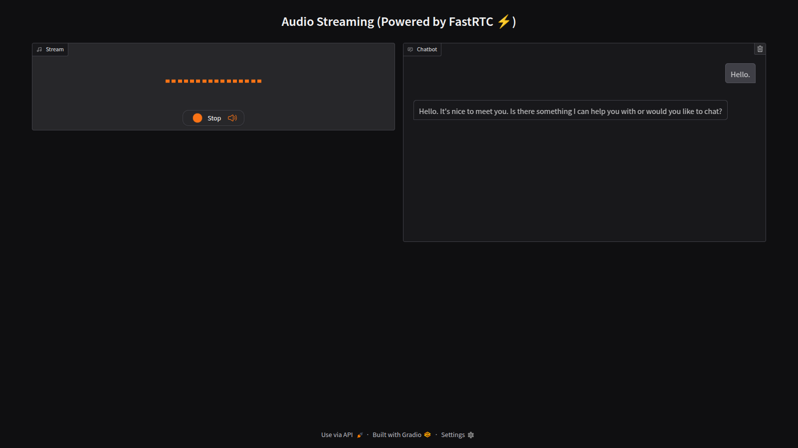

# Talk To AI with FastRTC

A real-time voice conversation application powered by [FastRTC](https://fastrtc.org/) that enables interactive audio communication with both Local and Cloud AI models. Inspired by [Talk To Claude](https://huggingface.co/spaces/fastrtc/talk-to-claude), this project transforms text-based AI interactions into natural voice conversations.

## Overview

This application creates a seamless voice interface to interact with AI models. It provides:

- Real-time speech-to-text conversion using various STT models
- Enables text generation using local or cloud-based language models through an OpenAI-compatible API
- High-quality text-to-speech synthesis
- Interactive web interface with audio visualization
- Flexibility to use either Local or Cloud APIs with simple configuration changes



## System Architecture

The application follows a modular architecture with the following components:

```
┌────────────────┐      ┌────────────────┐      ┌────────────────┐
│   Web Browser  │<────>│  FastRTC API   │<────>│  OpenAI API    │
│  (WebRTC+UI)   │      │  (Python App)  │      │(Local or Cloud)│
└────────────────┘      └────────────────┘      └────────────────┘
                                                       ▲
                               │───────────────────────│───────────────────────│
                               ▼                       ▼                       ▼
                        ┌────────────────┐      ┌────────────────┐     ┌────────────────┐
                        │   STT Server   │      │   LLM Server   │     │   TTS Server   │
                        │(Local or Cloud)│      │(Local or Cloud)│     │(Local or Cloud)│
                        └────────────────┘      └────────────────┘     └────────────────┘
```

## API Compatibility

The application has been tested with the following API combinations:

### 1. Local APIs    
- **STT**: [LocalAI with whisper.cpp backend](https://localai.io/features/audio-to-text/), [FastWhisperAPI](https://github.com/3choff/FastWhisperAPI)    
- **LLM**: [LocalAI with llama.cpp backend](https://localai.io/features/text-generation/), [MLC LLM](https://llm.mlc.ai/)
- **TTS**: [LocalAI with Piper backend](https://localai.io/features/text-to-audio/), [FastKoko](https://github.com/remsky/Kokoro-FastAPI/)  

### 2. Cloud APIs    
- **STT**: [Groq](https://console.groq.com/docs/speech-to-text)    
- **LLM**: [Groq](https://console.groq.com/docs/text-chat)    
- **TTS**: [Microsoft Edge TTS with openai-edge-tts](https://github.com/travisvn/openai-edge-tts)

## Features

- **API Flexibility**: Switch between local and cloud APIs with simple .env file changes
- **Real-time Voice Interaction**: Speak naturally and receive AI responses as audio
- **WebRTC Integration**: Low-latency audio streaming with network traversal capability
- **Progressive TTS Playback**: Audio responses begin playing as soon as sentences are completed
- **Responsive Audio Visualization**: Visual feedback of audio input/output
- **Configurable AI Models**: Easily switch between different AI models
- **Customizable Voice Settings**: Configure voice, language and audio format
- **Multiple Deployment Options**: UI, API, or phone integration

## Prerequisites

- Python 3.8+
- Local AI instance or Cloud API credentials
- FastRTC-compatible environment
- Modern web browser with WebRTC support

## Installation

1. Clone the repository:
   ```bash
   git clone https://github.com/limcheekin/talk-to-ai.git
   cd talk-to-ai
   ```

2. Create and activate a virtual environment:
   ```bash
   python -m venv .venv
   source .venv/bin/activate  # On Windows: .venv\Scripts\activate
   ```

3. Install dependencies:
   ```bash
   pip install -r requirements.txt
   ```

4. Configure environment variables:
   ```bash
   cp .env.example .env
   # Edit .env with your settings
   ```

## Configuration

Edit the `.env` file to configure the following settings. You can easily switch between local and cloud providers by updating these settings:

### LLM Configuration
- `LLM_BASE_URL`: URL of your AI instance (e.g., "http://192.168.1.111:8880/v1" for LocalAI or "https://api.groq.com/openai/v1" for Groq)
- `LLM_MODEL`: Name of the language model to use (e.g., "llama-3.2-3b-instruct-q4_k_m" for LocalAI or "llama3-8b-8192" for Groq)
- `LLM_API_KEY`: API key for your AI service (required for cloud APIs, `dummy_api_key` for local)

### Speech-to-Text Configuration
- `STT_BASE_URL`: URL of your STT service (can be LocalAI or cloud service like Groq)
- `STT_API_KEY`: API key for STT service (required for cloud APIs)
- `STT_MODEL`: Model to use for speech recognition (e.g., "whisper-base" for LocalAI or "whisper-large-v3" for Groq)
- `STT_RESPONSE_FORMAT`: Format for STT responses (e.g., "verbose_json")
- `LANGUAGE`: Language code for speech recognition (e.g., "en")

### Text-to-Speech Configuration
- `TTS_BASE_URL`: URL of your TTS service (LocalAI, FastKoko, or cloud services like Edge TTS)
- `TTS_API_KEY`: API key for TTS service (required for cloud APIs)
- `TTS_MODEL`: TTS model to use (e.g., "kokoro" or "tts-1-hd" or "tts-1")
- `TTS_VOICE`: Voice ID to use (e.g., "af_heart" for Kokoro or "en-US-AriaNeural" for Edge TTS)
- `TTS_BACKEND`: TTS backend identifier (e.g., "kokoro" or "edge-tts")
- `TTS_AUDIO_FORMAT`: Output audio format (e.g., "pcm")

### Application Mode
- `MODE`: Deployment mode ("UI", "PHONE", or "API")

## Running the Application

Start the application using the provided shell script:

```bash
chmod +x run.sh
./run.sh
```

Or run it directly with Python:

```bash
python app.py
```

The application will be available at:
- UI mode: `http://localhost:7860`
- API mode: `http://localhost:7860/`

## Usage

1. Open the web interface in your browser
2. Click the microphone icon or "Click to Access Microphone", allow microphone access when prompted
3. Click the "Record" button to initialize the WebRTC connection
4. Speak naturally after the connection is established
5. The application will convert your speech to text, process it with the AI model, and provide an audio response
6. The conversation history will be displayed in the chat window

## Technical Details

### Components

- **app.py**: Main application server handling WebRTC connections and API endpoints
- **speech.py**: Client for speech-to-text and text-to-speech services
- **settings.py**: Configuration management using Pydantic
- **index.html**: Web interface with WebRTC client implementation
- **requirements.txt**: Python dependencies
- **run.sh**: Convenience script to run the application

### Key Technologies

- **FastRTC**: Handles WebRTC connections and audio streaming
- **OpenAI API Client**: Used for compatible interfaces with local APIs and cloud services
- **Gradio**: Provides UI components and server functionality
- **Pydantic**: Configuration and settings management
- **WebRTC**: Browser-based real-time communication

## Customization

### Switching Between Local and Cloud APIs

Simply update the `.env` file with appropriate URLs and API keys:

#### For Local API Setup:
```
LLM_BASE_URL="http://192.168.1.111:8880/v1"
LLM_MODEL="llama-3.2-3b-instruct-q4_k_m"
LLM_API_KEY="sk-1" # dummy api key required by openai package

STT_BASE_URL="http://192.168.1.111:8880/v1" # or your FastWhisperAPI instance
STT_MODEL="whisper-base" # or "small.en"

TTS_BASE_URL="http://192.168.1.111:8880/v1"  # or your FastKoko instance
TTS_MODEL="en-us-ryan-high.onnx" # or "kokoro"
TTS_VOICE="en-us-ryan-high.onnx" # or "af_heart"
TTS_BACKEND="piper" # or "kokoro"
```

#### For Cloud API Setup:
```
LLM_BASE_URL="https://api.groq.com/openai/v1"
LLM_MODEL="llama3-8b-8192"
LLM_API_KEY="your-groq-api-key"

STT_BASE_URL="https://api.groq.com/openai/v1"
STT_MODEL="whisper-large-v3"
STT_API_KEY="your-groq-api-key"

TTS_BASE_URL="https://your-edge-tts-server/v1"
TTS_MODEL="tts-1-hd"
TTS_VOICE="en-US-AriaNeural"
```

### Voice Customization

Modify the TTS settings in `.env` to change voice characteristics:

```
TTS_VOICE="different_voice"  # Voice ID depends on your TTS provider
```

### UI Customization

The web interface can be customized by editing the `index.html` file. The interface uses standard HTML, CSS, and JavaScript.

## Troubleshooting

### Connection Issues
- Ensure your AI services (local or cloud) are accessible
- Check if the provided URLs in `.env` are correct
- Verify API keys are valid for cloud services
- Verify that WebRTC is supported in your browser
- If behind a firewall, ensure WebRTC traffic is allowed

### Audio Problems
- Check microphone permissions in your browser
- Ensure audio output is enabled and volume is up
- Try a different browser if issues persist
- For local APIs, verify the models are properly loaded

### API-Specific Issues
- **Local APIs**: Ensure sufficient system resources for running models
- **Cloud APIs**: Check API quotas and rate limits
- Verify API endpoint formatting is correct for your chosen provider

### Performance Considerations
- STT and TTS processing can be resource-intensive for local setups
- Smaller models may provide faster responses at the cost of quality
- Consider adjusting the concurrent user limit based on your server capacity
- Cloud APIs typically offer better performance but at a cost

## Contributing
Contributions are welcome! To contribute:
1. Fork the repository.
2. Create a new branch:
   ```bash
   git checkout -b feature-name
   ```
3. Commit your changes:
   ```bash
   git commit -m "Add feature description"
   ```
4. Push to the branch:
   ```bash
   git push origin feature-name
   ```
5. Open a pull request.

## License

This project is open source and available under the [MIT License](LICENSE).

## Acknowledgements

This project builds upon and integrates numerous open-source projects and commercial APIs:

### Core Technology
- [FastRTC](https://fastrtc.org/) by Hugging Face - For real-time communication capabilities
- [WebRTC](https://webrtc.org/) - For browser-based real-time communication protocol
- [Gradio](https://gradio.app/) - For UI components and server functionality
- [Pydantic](https://pydantic.dev/opensource) - For configuration and validation

### Inspiration
- [Talk To Claude](https://huggingface.co/spaces/fastrtc/talk-to-claude) - The original project that inspired this adaptation

### Local AI Solutions
- [LocalAI](https://localai.io/) - For local deployment of AI models
  - [whisper.cpp](https://github.com/ggerganov/whisper.cpp) - Backend for speech-to-text
  - [llama.cpp](https://github.com/ggerganov/llama.cpp) - Backend for text generation
  - [Piper](https://github.com/rhasspy/piper) - Backend for text-to-speech
- [FastWhisperAPI](https://github.com/3choff/FastWhisperAPI) - For efficient speech recognition
- [MLC LLM](https://llm.mlc.ai/) - For local deployment of language models
- [FastKoko](https://github.com/remsky/Kokoro-FastAPI/) - For local text-to-speech synthesis
- [Kokoro](https://huggingface.co/hexgrad/Kokoro-82M) - The underlying TTS model for FastKoko

### Cloud Services
- [Groq](https://groq.com/) - For cloud LLM and STT services
  - Groq's [Speech-to-Text API](https://console.groq.com/docs/speech-to-text)
  - Groq's [Text Chat API](https://console.groq.com/docs/text-chat)
- Microsoft Edge TTS - For cloud text-to-speech
- [openai-edge-tts](https://github.com/travisvn/openai-edge-tts) - For OpenAI-compatible interface to Edge TTS

### Additional Libraries
- Please refer to the [requirements.txt](requirements.txt)

We extend our sincere appreciation to all the developers and organizations that have made their work available for integration into this project.